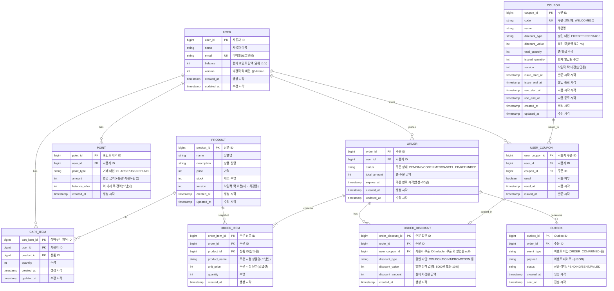

# ERD (Entity Relationship Diagram)

## ERD 다이어그램



---

## 테이블 상세 명세

### 1. USER (사용자)

사용자 기본 정보 및 포인트 잔액을 저장하는 테이블

| 컬럼명        | 타입     | 제약조건 | 설명 |
|------------|--------|----------|------|
| user_id    | BIGINT | PK, AUTO_INCREMENT | 사용자 ID |
| name       | VARCHAR(100) | NOT NULL | 사용자 이름 |
| email      | VARCHAR(255) | NOT NULL, UNIQUE | 이메일 (로그인용) |
| balance    | INT    | NOT NULL, DEFAULT 0, CHECK >= 0 | 현재 포인트 잔액 (권위 소스) |
| version    | INT    | NOT NULL, DEFAULT 0 | 낙관적 락 버전 (@Version) |
| created_at | TIMESTAMP | NOT NULL, DEFAULT CURRENT_TIMESTAMP | 생성 시각 |
| updated_at | TIMESTAMP | NOT NULL, DEFAULT CURRENT_TIMESTAMP ON UPDATE | 수정 시각 |

**인덱스:**
- PRIMARY KEY: `user_id`
- UNIQUE KEY: `email`

**비즈니스 규칙:**
- `balance`는 포인트 잔액의 권위 소스(Source of Truth)
- 포인트 거래 시 `balance`와 `version`을 동시에 업데이트 (낙관적 락)
- `POINT` 테이블의 `balance_after`는 감사 추적용 스냅샷

---

### 2. PRODUCT (상품)

상품 정보 및 재고를 관리하는 테이블

| 컬럼명 | 타입 | 제약조건 | 설명 |
|--------|------|----------|------|
| product_id | BIGINT | PK, AUTO_INCREMENT | 상품 ID |
| name | VARCHAR(200) | NOT NULL | 상품명 |
| description | TEXT | NULL | 상품 설명 |
| price | INT | NOT NULL, CHECK >= 0 | 가격 |
| stock | INT | NOT NULL, CHECK >= 0 | 재고 수량 |
| version | INT | NOT NULL, DEFAULT 0 | 낙관적 락 버전 |
| created_at | TIMESTAMP | NOT NULL, DEFAULT CURRENT_TIMESTAMP | 생성 시각 |
| updated_at | TIMESTAMP | NOT NULL, DEFAULT CURRENT_TIMESTAMP ON UPDATE | 수정 시각 |

**인덱스:**
- PRIMARY KEY: `product_id`

**비즈니스 규칙:**
- 재고 차감 시 낙관적 락 사용 (`version` 컬럼)
- 재고는 0 이상이어야 함

---

### 3. CART_ITEM (장바구니)

사용자의 장바구니 항목을 저장하는 테이블

| 컬럼명 | 타입 | 제약조건 | 설명 |
|--------|------|----------|------|
| cart_item_id | BIGINT | PK, AUTO_INCREMENT | 장바구니 항목 ID |
| user_id | BIGINT | FK, NOT NULL | 사용자 ID |
| product_id | BIGINT | FK, NOT NULL | 상품 ID |
| quantity | INT | NOT NULL, CHECK > 0 | 수량 |
| created_at | TIMESTAMP | NOT NULL, DEFAULT CURRENT_TIMESTAMP | 생성 시각 |
| updated_at | TIMESTAMP | NOT NULL, DEFAULT CURRENT_TIMESTAMP ON UPDATE | 수정 시각 |

**인덱스:**
- PRIMARY KEY: `cart_item_id`
- INDEX: `user_id` (장바구니 조회 성능)
- UNIQUE KEY: `(user_id, product_id)` (중복 방지)

**외래키:**
- `user_id` → `USER(user_id)` ON DELETE CASCADE
- `product_id` → `PRODUCT(product_id)` ON DELETE CASCADE

**비즈니스 규칙:**
- 동일 사용자가 동일 상품을 중복 담을 수 없음 (UNIQUE 제약)
- 이미 담긴 상품을 추가하면 수량 증가

---

### 4. ORDER (주문)

주문 기본 정보를 저장하는 테이블

| 컬럼명 | 타입 | 제약조건 | 설명 |
|--------|------|----------|------|
| order_id | BIGINT | PK, AUTO_INCREMENT | 주문 ID |
| user_id | BIGINT | FK, NOT NULL | 사용자 ID |
| status | VARCHAR(20) | NOT NULL | 주문 상태 (PENDING/CONFIRMED/CANCELLED/REFUNDED) |
| total_amount | INT | NOT NULL, CHECK >= 0 | 총 주문 금액 |
| expires_at | TIMESTAMP | NOT NULL | 주문 만료 시각 (생성 시각 + 30분) |
| created_at | TIMESTAMP | NOT NULL, DEFAULT CURRENT_TIMESTAMP | 생성 시각 |
| updated_at | TIMESTAMP | NOT NULL, DEFAULT CURRENT_TIMESTAMP ON UPDATE | 수정 시각 |

**인덱스:**
- PRIMARY KEY: `order_id`
- INDEX: `user_id` (사용자별 주문 조회)
- INDEX: `(status, expires_at)` (만료 주문 배치 처리)

**외래키:**
- `user_id` → `USER(user_id)` ON DELETE RESTRICT

**상태 전이:**
```
PENDING → CONFIRMED (결제 성공)
PENDING → CANCELLED (30분 경과 또는 사용자 취소)
CONFIRMED → REFUNDED (환불 요청)
```

---

### 5. ORDER_ITEM (주문 상품)

주문에 포함된 상품 정보를 스냅샷으로 저장하는 테이블

| 컬럼명 | 타입 | 제약조건 | 설명 |
|--------|------|----------|------|
| order_item_id | BIGINT | PK, AUTO_INCREMENT | 주문 상품 ID |
| order_id | BIGINT | FK, NOT NULL | 주문 ID |
| product_id | BIGINT | FK, NOT NULL | 상품 ID (참조용) |
| product_name | VARCHAR(200) | NOT NULL | 상품명 (스냅샷) |
| unit_price | INT | NOT NULL, CHECK >= 0 | 단가 (스냅샷) |
| quantity | INT | NOT NULL, CHECK > 0 | 수량 |
| created_at | TIMESTAMP | NOT NULL, DEFAULT CURRENT_TIMESTAMP | 생성 시각 |

**인덱스:**
- PRIMARY KEY: `order_item_id`
- INDEX: `order_id` (주문별 상품 조회)
- INDEX: `(product_id, created_at)` (상품별 판매 통계)

**외래키:**
- `order_id` → `ORDER(order_id)` ON DELETE CASCADE
- `product_id` → `PRODUCT(product_id)` ON DELETE RESTRICT

**비즈니스 규칙:**
- 주문 생성 시점의 상품명과 가격을 스냅샷으로 저장
- 이후 상품 정보 변경에 영향받지 않음

---

### 6. POINT (포인트)

포인트 충전/사용/환불 내역을 저장하는 테이블

| 컬럼명 | 타입 | 제약조건 | 설명 |
|--------|------|----------|------|
| point_id | BIGINT | PK, AUTO_INCREMENT | 포인트 내역 ID |
| user_id | BIGINT | FK, NOT NULL | 사용자 ID |
| point_type | VARCHAR(20) | NOT NULL | 포인트 타입 (CHARGE/USE/REFUND) |
| amount | INT | NOT NULL, CHECK > 0 | 금액 |
| balance_after | INT | NOT NULL, CHECK >= 0 | 거래 후 잔액 |
| created_at | TIMESTAMP | NOT NULL, DEFAULT CURRENT_TIMESTAMP | 생성 시각 |

**인덱스:**
- PRIMARY KEY: `point_id`
- INDEX: `(user_id, created_at DESC)` (사용자별 내역 조회, 최신순)

**외래키:**
- `user_id` → `USER(user_id)` ON DELETE RESTRICT

**비즈니스 규칙:**
- `balance_after`는 감사 추적용 스냅샷 (검증에 사용)
- 권위 소스는 `USER.balance`
- 충전: 1,000원 ~ 1,000,000원
- Append-Only (삭제/수정 불가)
- 포인트 거래 시 USER.balance와 POINT.balance_after가 일치해야 함

---

### 7. COUPON (쿠폰)

쿠폰 마스터 정보를 저장하는 테이블

| 컬럼명 | 타입 | 제약조건 | 설명 |
|--------|------|----------|------|
| coupon_id | BIGINT | PK, AUTO_INCREMENT | 쿠폰 ID |
| code | VARCHAR(50) | NOT NULL, UNIQUE | 쿠폰 코드 (예: WELCOME10, SUMMER2025) |
| name | VARCHAR(100) | NOT NULL | 쿠폰명 |
| discount_type | VARCHAR(20) | NOT NULL | 할인 타입 (FIXED/PERCENTAGE) |
| discount_value | INT | NOT NULL, CHECK > 0 | 할인 값 (금액 또는 퍼센트) |
| total_quantity | INT | NOT NULL, CHECK > 0 | 총 발급 수량 |
| issued_quantity | INT | NOT NULL, DEFAULT 0, CHECK >= 0 | 현재 발급된 수량 |
| version | INT | NOT NULL, DEFAULT 0 | 낙관적 락 버전 |
| issue_start_at | TIMESTAMP | NOT NULL | 발급 시작 시각 |
| issue_end_at | TIMESTAMP | NOT NULL | 발급 종료 시각 |
| use_start_at | TIMESTAMP | NOT NULL | 사용 시작 시각 |
| use_end_at | TIMESTAMP | NOT NULL | 사용 종료 시각 |
| created_at | TIMESTAMP | NOT NULL, DEFAULT CURRENT_TIMESTAMP | 생성 시각 |
| updated_at | TIMESTAMP | NOT NULL, DEFAULT CURRENT_TIMESTAMP ON UPDATE | 수정 시각 |

**인덱스:**
- PRIMARY KEY: `coupon_id`
- UNIQUE KEY: `code`
- INDEX: `(issue_start_at, issue_end_at)` (발급 가능 쿠폰 조회)

**체크 제약:**
- `issued_quantity <= total_quantity`
- `issue_start_at < issue_end_at`
- `use_start_at < use_end_at`

**비즈니스 규칙:**
- 발급 시 낙관적 락 사용 (`version` 컬럼)
- 발급 수량 소진 시 더 이상 발급 불가
- 쿠폰 코드는 대소문자 구분하며 중복 불가

---

### 8. USER_COUPON (사용자 쿠폰)

사용자에게 발급된 쿠폰을 저장하는 테이블

| 컬럼명 | 타입 | 제약조건 | 설명 |
|--------|------|----------|------|
| user_coupon_id | BIGINT | PK, AUTO_INCREMENT | 사용자 쿠폰 ID |
| user_id | BIGINT | FK, NOT NULL | 사용자 ID |
| coupon_id | BIGINT | FK, NOT NULL | 쿠폰 ID |
| used | BOOLEAN | NOT NULL, DEFAULT FALSE | 사용 여부 |
| used_at | TIMESTAMP | NULL | 사용 시각 |
| issued_at | TIMESTAMP | NOT NULL, DEFAULT CURRENT_TIMESTAMP | 발급 시각 |

**인덱스:**
- PRIMARY KEY: `user_coupon_id`
- UNIQUE KEY: `(user_id, coupon_id)` (중복 발급 방지)
- INDEX: `(user_id, used)` (사용자별 미사용 쿠폰 조회)

**외래키:**
- `user_id` → `USER(user_id)` ON DELETE CASCADE
- `coupon_id` → `COUPON(coupon_id)` ON DELETE RESTRICT

**비즈니스 규칙:**
- 동일 사용자는 동일 쿠폰을 1회만 발급 가능 (UNIQUE 제약)
- 사용 시 `used = TRUE`, `used_at` 기록

---

### 9. ORDER_DISCOUNT (주문 할인)

주문에 적용된 할인 정보를 저장하는 테이블 (쿠폰, 프로모션 등)

| 컬럼명 | 타입 | 제약조건 | 설명 |
|--------|------|----------|------|
| order_discount_id | BIGINT | PK, AUTO_INCREMENT | 주문 할인 ID |
| order_id | BIGINT | FK, NOT NULL | 주문 ID |
| user_coupon_id | BIGINT | FK, NULL | 사용자 쿠폰 ID (쿠폰 할인이 아니면 NULL) |
| discount_type | VARCHAR(20) | NOT NULL | 할인 타입 (COUPON/POINT/PROMOTION 등) |
| discount_value | INT | NOT NULL | 할인 정책 값 (예: 5000원 또는 10%) |
| discount_amount | INT | NOT NULL, CHECK >= 0 | 실제 차감된 금액 |
| created_at | TIMESTAMP | NOT NULL, DEFAULT CURRENT_TIMESTAMP | 생성 시각 |

**인덱스:**
- PRIMARY KEY: `order_discount_id`
- INDEX: `order_id` (주문별 할인 조회)
- INDEX: `user_coupon_id` (쿠폰 사용 이력 조회)

**외래키:**
- `order_id` → `ORDER(order_id)` ON DELETE CASCADE
- `user_coupon_id` → `USER_COUPON(user_coupon_id)` ON DELETE RESTRICT (nullable)

**비즈니스 규칙:**
- 쿠폰 할인인 경우 `user_coupon_id` 필수, `discount_type = 'COUPON'`
- 쿠폰이 아닌 할인(프로모션 등)은 `user_coupon_id = NULL`
- MVP에서는 주문당 1개 할인만 지원 (향후 여러 할인 조합 가능하도록 설계)
- 할인 금액은 주문 금액을 초과할 수 없음

---

### 10. OUTBOX (이벤트 큐)

외부 시스템으로 전송할 이벤트를 저장하는 테이블

| 컬럼명 | 타입 | 제약조건 | 설명 |
|--------|------|----------|------|
| outbox_id | BIGINT | PK, AUTO_INCREMENT | Outbox ID |
| order_id | BIGINT | FK, NOT NULL | 주문 ID |
| event_type | VARCHAR(50) | NOT NULL | 이벤트 타입 (ORDER_CONFIRMED 등) |
| payload | TEXT | NOT NULL | 이벤트 페이로드 (JSON) |
| status | VARCHAR(20) | NOT NULL, DEFAULT 'PENDING' | 상태 (PENDING/SENT/FAILED) |
| created_at | TIMESTAMP | NOT NULL, DEFAULT CURRENT_TIMESTAMP | 생성 시각 |
| sent_at | TIMESTAMP | NULL | 전송 시각 |

**인덱스:**
- PRIMARY KEY: `outbox_id`
- INDEX: `(status, created_at)` (전송 대기 이벤트 조회)
- INDEX: `order_id` (주문별 이벤트 조회)

**외래키:**
- `order_id` → `ORDER(order_id)` ON DELETE CASCADE

**비즈니스 규칙:**
- 주문 확정(`CONFIRMED`) 시 이벤트 생성
- 별도 배치 프로세스에서 전송 처리
- 트랜잭션 보장 (주문 확정과 Outbox 기록은 동일 트랜잭션)

---

## 관계 요약

### 1:N 관계
- `USER` 1 : N `CART_ITEM` - 사용자는 여러 장바구니 항목을 가짐
- `USER` 1 : N `ORDER` - 사용자는 여러 주문을 가짐
- `USER` 1 : N `POINT` - 사용자는 여러 포인트 내역을 가짐
- `USER` 1 : N `USER_COUPON` - 사용자는 여러 쿠폰을 소유
- `PRODUCT` 1 : N `CART_ITEM` - 상품은 여러 장바구니에 담김
- `PRODUCT` 1 : N `ORDER_ITEM` - 상품은 여러 주문에 포함됨
- `ORDER` 1 : N `ORDER_ITEM` - 주문은 여러 상품을 포함
- `ORDER` 1 : N `OUTBOX` - 주문은 여러 이벤트를 생성
- `COUPON` 1 : N `USER_COUPON` - 쿠폰은 여러 사용자에게 발급됨

### 1:N 관계 (향후 확장 가능)
- `ORDER` 1 : 0..N `ORDER_DISCOUNT` - 주문은 여러 할인을 가질 수 있음 
- `USER_COUPON` 1 : 0..1 `ORDER_DISCOUNT` - 사용자 쿠폰은 최대 1개의 주문에 사용됨

---

## 주요 제약조건 및 정합성

### 1. 낙관적 락 (Optimistic Lock)
- **PRODUCT.version**: 재고 차감 시 동시성 제어
- **COUPON.version**: 쿠폰 발급 시 동시성 제어

### 2. 유니크 제약 (Unique Constraints)
- **USER.email**: 이메일 중복 방지
- **CART_ITEM(user_id, product_id)**: 장바구니 중복 방지
- **USER_COUPON(user_id, coupon_id)**: 쿠폰 중복 발급 방지

### 3. 체크 제약 (Check Constraints)
- 금액/수량 필드는 0 이상
- 쿠폰 발급 수량은 총 수량 이하
- 날짜 범위 유효성 (시작 < 종료)

### 4. 외래키 삭제 정책
- **CASCADE**: 부모 삭제 시 자식도 삭제 (CART_ITEM, ORDER_ITEM, ORDER_DISCOUNT, OUTBOX, USER_COUPON)
- **RESTRICT**: 부모 삭제 방지 (ORDER, POINT, PRODUCT 참조)

---

## 인덱스 전략

### 성능 최적화를 위한 주요 인덱스

1. **장바구니 조회**: `CART_ITEM(user_id)`
2. **주문 내역 조회**: `ORDER(user_id)`
3. **포인트 내역 조회**: `POINT(user_id, created_at DESC)`
4. **미사용 쿠폰 조회**: `USER_COUPON(user_id, used)`
5. **만료 주문 배치**: `ORDER(status, expires_at)`
6. **Outbox 전송 배치**: `OUTBOX(status, created_at)`
7. **인기 상품 통계**: `ORDER_ITEM(product_id, created_at)`

---

## 데이터 정합성 보장

### 트랜잭션 범위

#### 1. 결제 트랜잭션
```sql
BEGIN;

-- 1) 재고 차감(낙관락)
UPDATE PRODUCT
SET stock = stock - :qty, version = version + 1
WHERE product_id = :pid AND version = :ver AND stock >= :qty;

-- 2) 쿠폰 사용 마킹
UPDATE USER_COUPON SET used=TRUE, used_at=NOW() WHERE user_coupon_id=:ucid;

-- 3) 사용자 잔액 차감(낙관락)
UPDATE USER
SET balance = balance - :finalAmount, version = version + 1
WHERE user_id = :uid AND version = :uver AND balance >= :finalAmount;

-- 4) 포인트 원장 기록(+스냅샷)
INSERT INTO POINT (user_id, point_type, amount, balance_after)
VALUES (:uid, 'USE', :finalAmount, (SELECT balance FROM USER WHERE user_id=:uid));

-- 5) 주문 확정
UPDATE `ORDER` SET status='CONFIRMED' WHERE order_id=:oid;

-- 6) 할인 기록(단건 정책이면 여기서 1개만)
INSERT INTO ORDER_DISCOUNT (order_id, user_coupon_id, discount_type, discount_value, discount_amount)
VALUES (:oid, :ucid, 'COUPON', :policyValue, :discountAmount);

-- 7) 아웃박스 이벤트
INSERT INTO OUTBOX (order_id, event_type, payload, status)
VALUES (:oid, 'ORDER_CONFIRMED', :jsonPayload, 'PENDING');

COMMIT;

```

#### 2. 환불 트랜잭션
```sql
BEGIN;

-- 1) 사용자 잔액 복원
UPDATE USER
SET balance = balance + :refundAmount, version = version + 1
WHERE user_id = :uid AND version = :uver;

-- 2) 포인트 원장 기록
INSERT INTO POINT (user_id, point_type, amount, balance_after)
VALUES (:uid, 'REFUND', :refundAmount, (SELECT balance FROM USER WHERE user_id=:uid));

-- 3) 재고 복원
UPDATE PRODUCT SET stock = stock + :qty WHERE product_id = :pid;

-- 4) 쿠폰 복원(유효기간 내이면)
UPDATE USER_COUPON SET used=FALSE, used_at=NULL WHERE user_coupon_id=:ucid;

-- 5) 주문 상태 변경
UPDATE `ORDER` SET status='REFUNDED' WHERE order_id=:oid;

COMMIT;

```

#### 3. 쿠폰 발급 트랜잭션
```sql
BEGIN TRANSACTION;
  -- 1. 발급 수량 증가 (낙관적 락)
  UPDATE COUPON SET issued_quantity = issued_quantity + 1, version = version + 1
  WHERE coupon_id = :cid AND version = version = :cver AND issued_quantity < total_quantity;

  -- 2. 사용자 쿠폰 생성
  INSERT INTO USER_COUPON (user_id, coupon_id, used, issued_at) VALUES (?, ?, FALSE, NOW());

COMMIT;
```

---

## 추가 고려사항

### 1. 파티셔닝 전략 (향후 확장)
- **POINT**: `created_at` 기준 월별 파티셔닝
- **ORDER**: `created_at` 기준 월별 파티셔닝
- **ORDER_ITEM**: `created_at` 기준 월별 파티셔닝
- **OUTBOX**: `created_at` 기준 주별 파티셔닝 + 전송 완료 후 아카이빙

### 2. 읽기 성능 최적화
- 포인트 잔액: 최신 `balance_after` 조회 (별도 캐싱 고려)
- 인기 상품: `ORDER_ITEM` 집계 + Redis 캐시
- 장바구니: 조회 시 상품 정보 JOIN

### 3. 데이터 보관 정책
- **OUTBOX**: 전송 완료 후 7일 보관
- **CART_ITEM**: 90일 미접속 사용자 장바구니 자동 삭제
- **ORDER**: 영구 보관 (법적 요구사항)
- **POINT**: 영구 보관 (감사 추적)