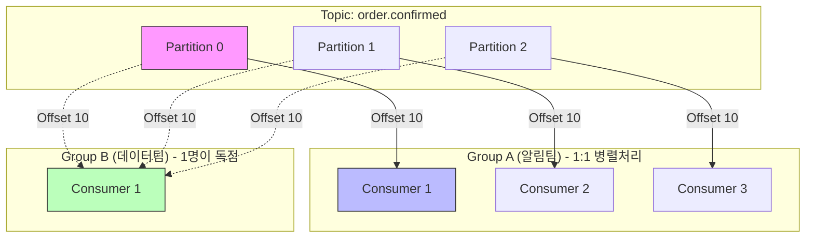
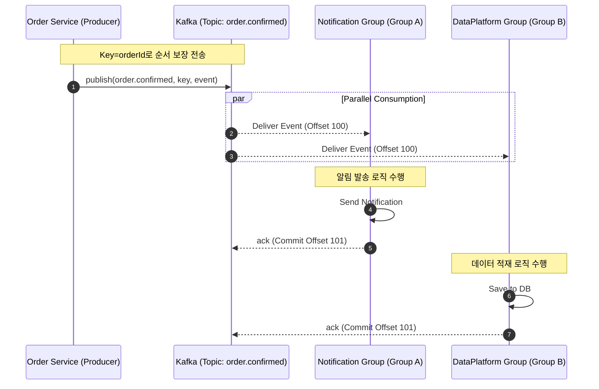

# Kafka 기초 학습 및 실무 활용 가이드

> **목표:** Kafka의 핵심 구성요소(Broker, Topic, Partition, Producer, Consumer, Group, Offset)를 **정확히 이해**하고, **실무 설정 포인트**를 정리한다.

---

## 1. 내가 Kafka를 처음 볼 때 헷갈렸던 핵심 3가지

### 1-1. “Kafka는 큐(Queue)인가요?”

처음엔 RabbitMQ 같은 “메시지 큐”로 생각해서 `consume하면 사라지나?`가 궁금했는데, Kafka는 개념이 달랐다.

* Kafka는 메시지를 **로그처럼 파일에 쌓아둔다(Append-only Log).**
* Consumer가 **Offset(오프셋)으로 '어디까지 읽었는지'**를 기록한다.
* 그래서 “메시지를 지운다”보다 **“읽은 위치를 커밋(Commit)한다”**가 정확한 표현이다.

### 1-2. “순서 보장”이 왜 토픽 전체가 아니라 파티션 안에서만 되지?

Kafka는 확장성을 위해 하나의 토픽을 여러 **파티션(Partition)**으로 쪼갠다.
**여러 파티션은 병렬 처리되는 대신, 전체 순서(전역 순서)는 깨진다.**

따라서 순서가 중요하다면 전략이 필요하다:

* **같은 흐름(예: 같은 주문 ID)**은 무조건 **같은 파티션**으로 가야 한다.
* → 이를 결정하는 것이 **Message Key**다.

### 1-3. “Consumer Group”이 왜 중요하지?

결론은 **확장성**과 **목적 분리**다.

* **같은 Group:** 파티션을 나눠서 처리한다. (병렬 처리 / Scale-out)
* **다른 Group:** 같은 메시지를 각 그룹이 독립적으로 모두 받는다. (기능 분리 / Pub-Sub)

---

## 2. Kafka 구성요소를 “역할 중심”으로 정리

### 2-1. Broker

Kafka 서버(클러스터의 노드).
토픽과 파티션을 저장하고, Producer/Consumer의 요청을 처리한다.

> **한 줄 정의:** Broker는 “데이터를 저장하고 전달하는 **실체**”다.

### 2-2. Topic

이벤트가 흘러가는 논리적 채널(카테고리). RDB의 **Table**과 비슷하다.

* `order.confirmed`: 주문 확정
* `order.status.changed`: 상태 변경

### 2-3. Partition

토픽을 물리적으로 나눈 단위.
**처리량(Throughput)**을 얻는 대신, **순서 보장은 파티션 내부로 한정**된다.

> **⚠️ 주의:** 파티션 개수는 운영 중에 늘리기는 쉽지만, **줄이는 것은 불가능**에 가깝다. 초기 설계 시 적절히 잡고 필요시 늘려가는 것이 좋다.

### 2-4. Producer

메시지를 생성하고 발송하는 주체.
개발 시 가장 중요한 본질 2가지는:

1. **어떤 토픽**으로 보낼 것인가?
2. **Key를 무엇으로 할 것인가?** (어떤 파티션으로 보낼지 결정)

### 2-5. Consumer

메시지를 꺼내 처리하는 주체.
처리가 끝나면 **Offset Commit**을 통해 "여기까지 처리 완료함"을 표시한다.

### 2-6. Consumer Group

* `order.confirmed` 메시지 하나를
* **Group A (데이터팀):** 적재 로직 수행
* **Group B (알림팀):** 고객 알림 발송


* 위처럼 **서로 다른 목적(Side Effect)을 분리**할 때 핵심적인 역할을 한다.

### 2-7. Offset

파티션 내의 메시지 위치 번호 (0부터 증가).
Consumer는 이 번호를 기억하여 중단 후 재시작해도 **마지막 위치 다음부터** 읽을 수 있다.

---

## 3. Producer / Partition / Consumer 수에 따른 데이터 흐름

이 부분이 카프카 동작 원리의 핵심이다.

### 3-1. P1, Partition 1, Group 1 (Consumer 1)

* **순서:** 완벽 보장
* **처리량:** 낮음 (병렬성 없음)

### 3-2. P1, Partition 3, Group 1 (Consumer 1)

* Consumer 1개가 파티션 3개를 혼자 다 처리한다.
* 병렬 처리는 안 되지만, 데이터는 3개 파티션에 분산 저장된다.

### 3-3. P1, Partition 3, Group 1 (Consumer 3) ✨ Best

* **이상적인 병렬 처리 구조.**
* 같은 그룹 내 Consumer들이 파티션을 1:1로 나눠 맡는다.
* **주의:** 파티션보다 Consumer가 많아지면(예: C4), 남는 Consumer는 **논다(Idle).**

### 3-4. P1, Partition 3, Group 2 (독립 소비)

* 같은 메시지를 '알림 서비스'와 '데이터 플랫폼'이 각각 받아야 할 때의 구조.

#### 📊 시각화: 파티션 할당과 컨슈머 그룹



---

## 4. Key 전략 (순서 보장과 Data Skew)

> **"순서가 중요하다면, 같은 흐름은 같은 파티션으로 보내야 한다."**

### 4-1. Key 사용 예시

```java
// 같은 주문(orderId)에 대한 이벤트는 순서대로 처리되어야 함
kafkaTemplate.send("order.confirmed", String.valueOf(orderId), event);

```

### 4-2. 주의: Data Skew (데이터 편향)

특정 Key(예: 초대박 난 상품 ID)에만 트래픽이 몰리면?

* 특정 파티션에만 데이터가 쌓이고, **특정 Consumer만 과부하**가 걸린다.
* 이 경우 Key 설계를 다시 하거나, 파티셔닝 전략을 수정해야 할 수도 있다.

---

## 5. Offset / 커밋(ACK) / 장애 대응

### 5-1. 수동 커밋을 선택한 이유

* **자동 커밋(Auto Commit):** 메시지를 가져오면(poll) 즉시 커밋. 처리 중 에러가 나면 메시지 유실 가능성 있음.
* **수동 커밋(Manual Commit):** `ack.acknowledge()`를 호출해야만 커밋.
* **성공 시:** `ack` 호출.
* **실패 시:** `ack` 하지 않고 Exception 발생 → 재시도(Retry) 유도.


### 5-2. 재시도와 DLQ (Dead Letter Queue)

계속 재시도만 하면 뒤에 있는 메시지가 처리가 안 되어 **병목(Head of Line Blocking)**이 생긴다.

* **전략:** N번 재시도 후에도 실패하면, **DLQ(죽은 메시지 보관소)**라는 별도 토픽으로 메시지를 보내고 `ack` 처리하여 다음 메시지로 넘어간다.

---

## 6. Spring Kafka 실무 설정 포인트

### 6-1. Producer 설정

* **`acks=all`**: 리더와 팔로워가 모두 저장했는지 확인. (속도 < **안전성**)
* **`retries=3`**: 네트워크 등 일시적 장애 대비.
* **`enable.idempotence=true` (멱등성)**:
* Retry 시 발생할 수 있는 **중복 전송(Duplicate)**을 막아준다. (Kafka가 Sequence Number로 중복 제거)


### 6-2. JSON 직렬화 & 타입 헤더

Object 전송 시 Consumer가 타입을 알 수 있도록 헤더 활용.

* Producer: `JsonSerializer.ADD_TYPE_INFO_HEADERS = true`
* Consumer: `JsonDeserializer.USE_TYPE_INFO_HEADERS = true`
* **보안:** `trusted.packages` 설정으로 허용 패키지 제한 필요.

---

## 7. 운영 핵심 개념 (Replication & Lag)

### 7-1. Replication (복제)과 ISR

브로커 하나가 죽어도 데이터가 안 날아가는 이유.

* **Replication Factor:** 보통 3으로 설정 (사본 3개 유지).
* **Leader:** 읽기/쓰기를 담당하는 대장.
* **Follower:** 뒤에서 복제만 해두는 예비군.
* **ISR (In-Sync Replicas):** Leader와 싱크가 맞는 팔로워 그룹. Leader가 죽으면 ISR 중 하나가 새 Leader가 된다.

### 7-2. Consumer Lag (랙)

* **정의:** `Topic 최신 Offset` - `Consumer 현재 Offset`
* **의미:** **"얼마나 처리가 밀려있는가?"**
* **활용:** Lag가 계속 늘어나면 시스템에 문제가 있는 것. 모니터링 1순위 지표다.

---

## 8. 전체 흐름 요약 (Sequence Diagram)

