# Kafka 시퀀스 다이어그램

이 문서는 주문/결제 시스템과 쿠폰 시스템의 상세한 처리 흐름을 Mermaid 시퀀스 다이어그램으로 시각화합니다.

---

## 1. 주문/결제 시스템 플로우

### 1.1 주문 생성 및 Outbox 저장 (동기)

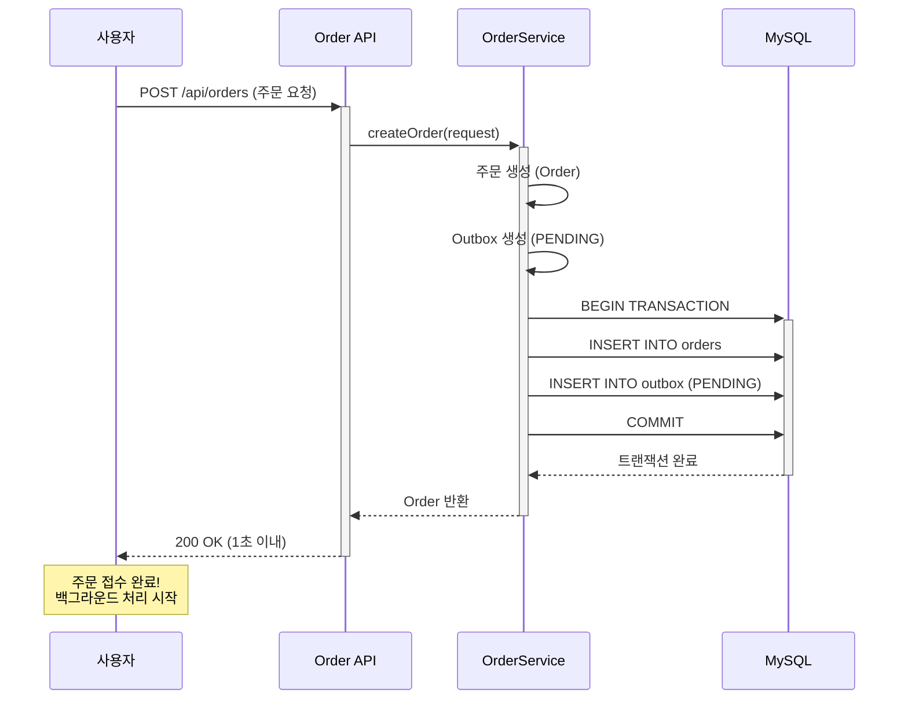

### 1.2 Outbox Poller → Kafka 발행 (비동기)

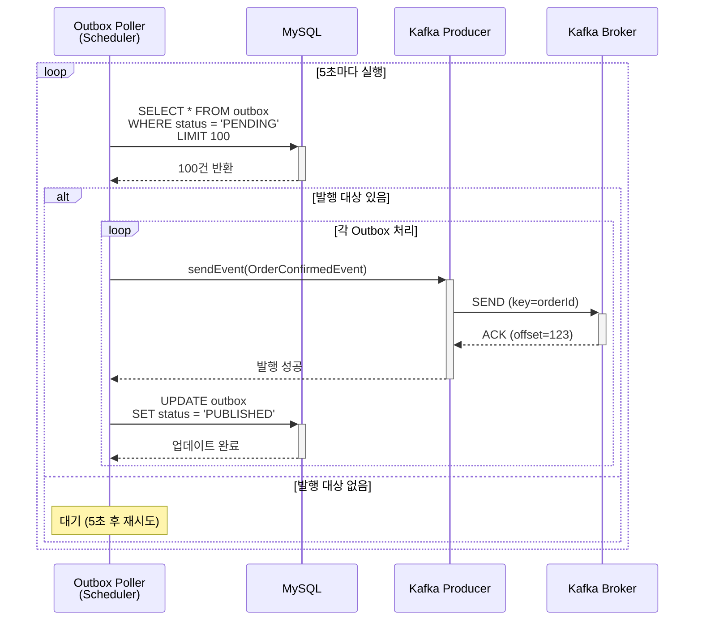

### 1.3 Kafka Consumer 처리 (병렬, 독립적)

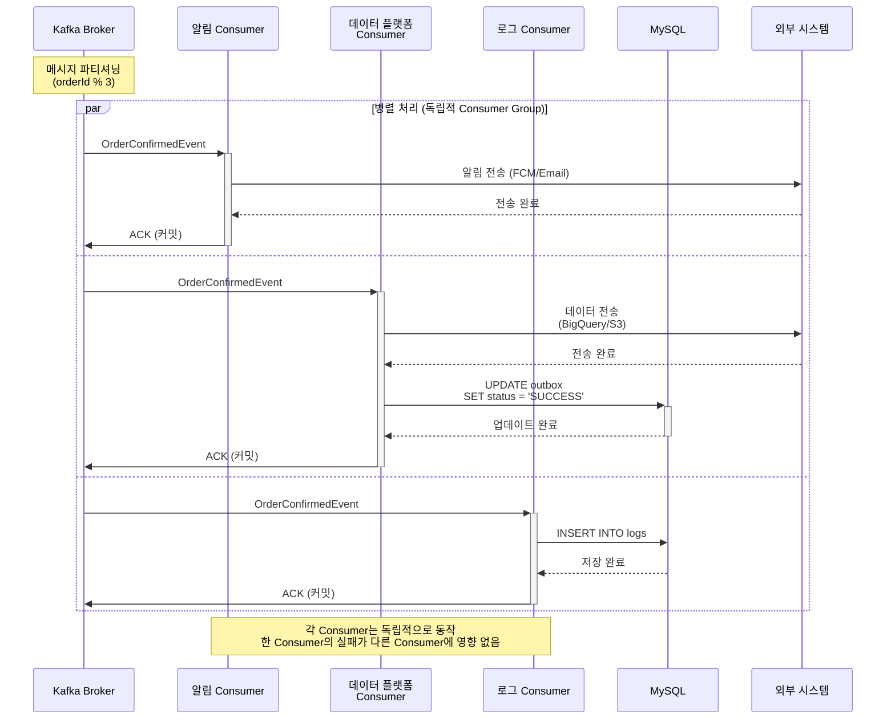

---

## 2. 쿠폰 시스템 플로우

### 2.1 쿠폰 발급 요청 및 Redis Stream 추가

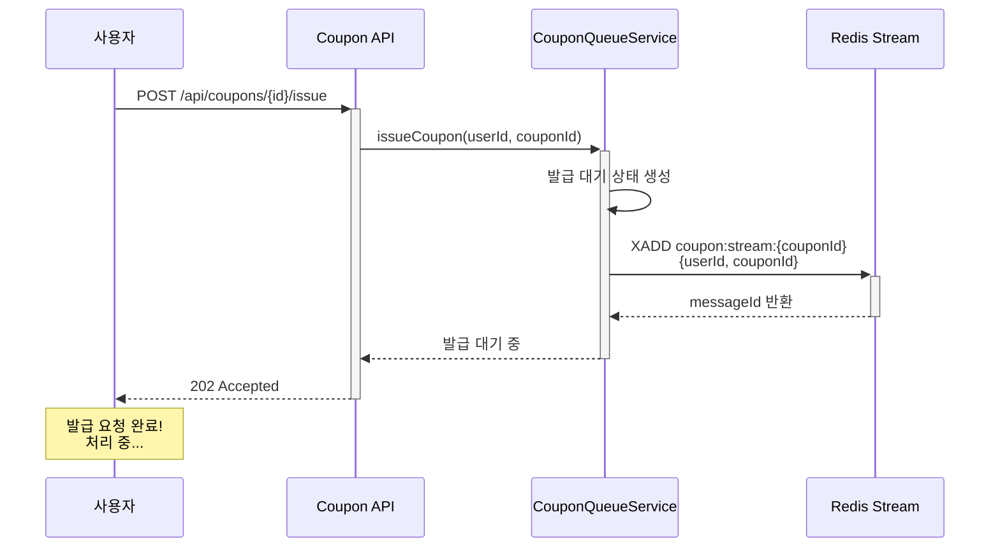

### 2.2 Redis Stream Consumer → DB 저장 → Kafka 발행

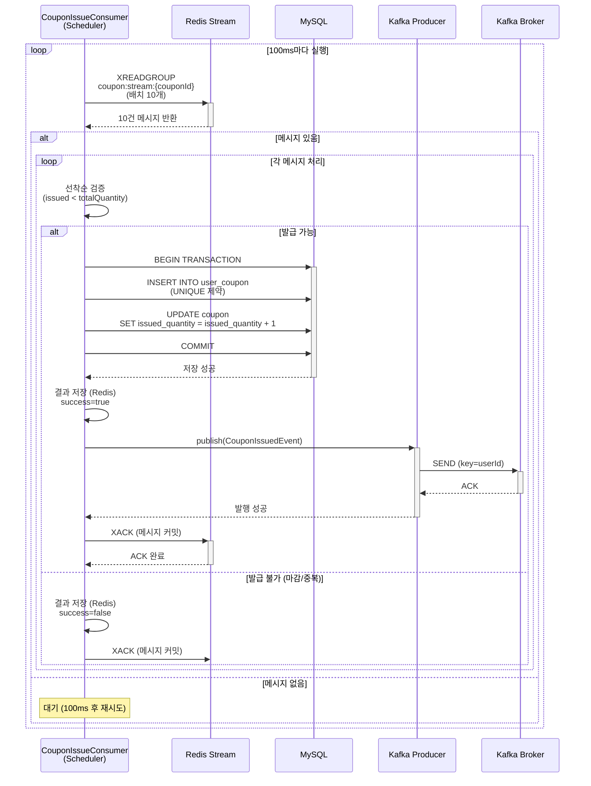

### 2.3 Kafka Consumer 처리 (병렬)

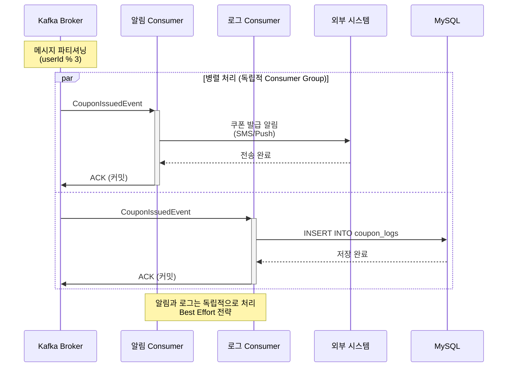

---

## 3. 순차 처리 전략: 콘서트 대기열 (참고용)

### 3.1 대기열 진입 및 순차 처리

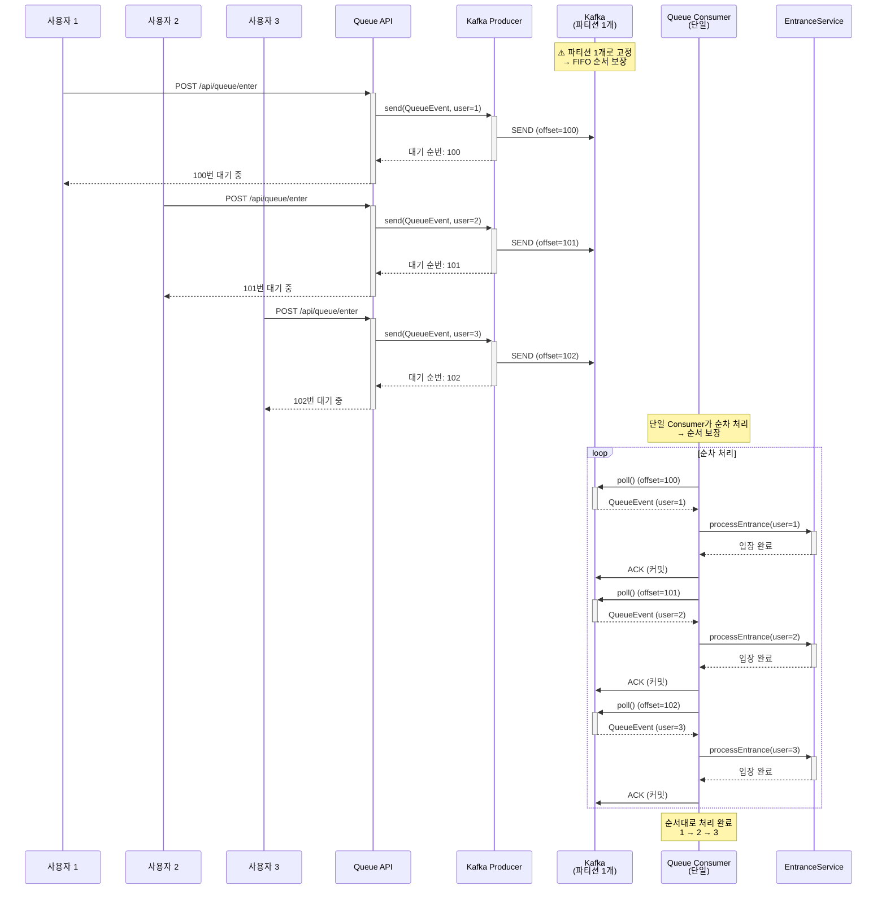

---

## 4. 장애 시나리오

### 4.1 Kafka Consumer 실패 및 재시도

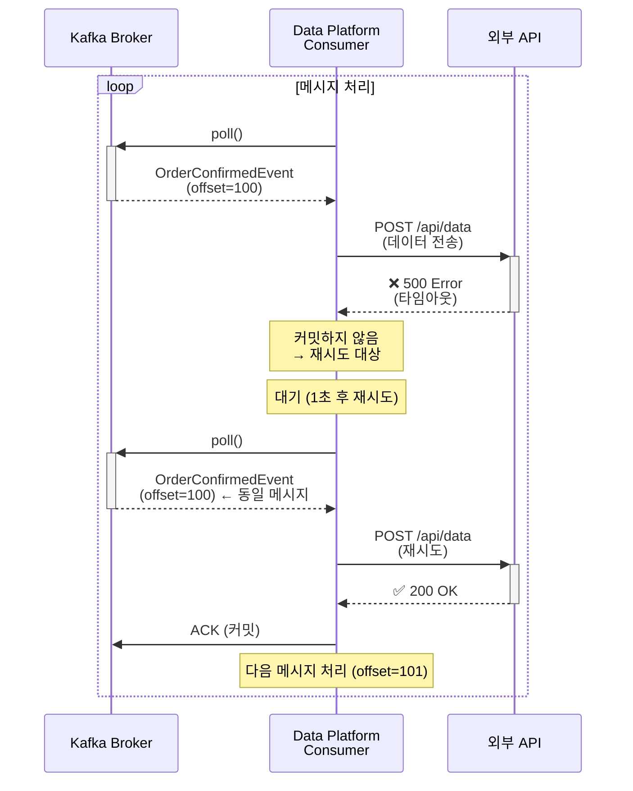

### 4.2 Outbox Poller 실패 및 재시도

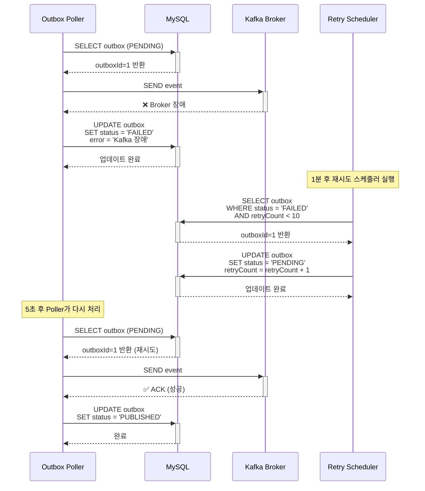

---

## 5. 플로우 비교: AS-IS vs TO-BE

### 5.1 AS-IS (동기 처리)

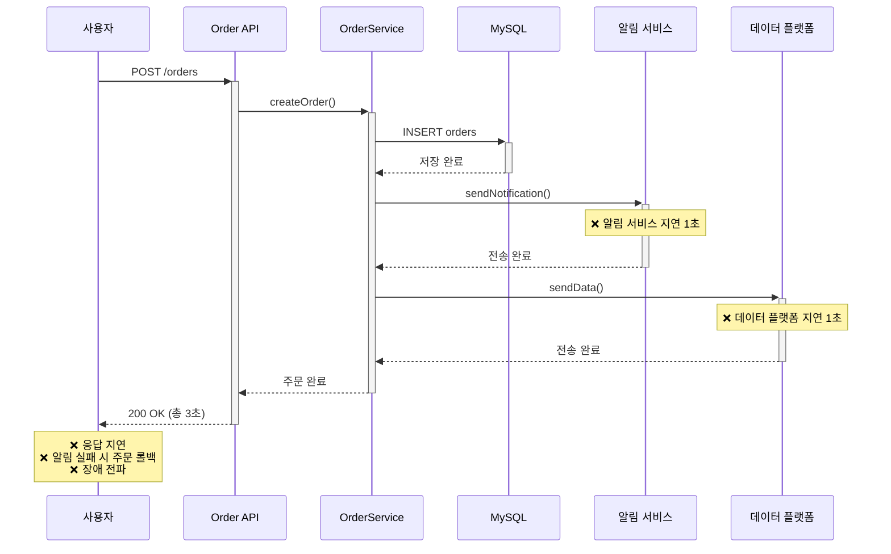

### 5.2 TO-BE (비동기 처리)

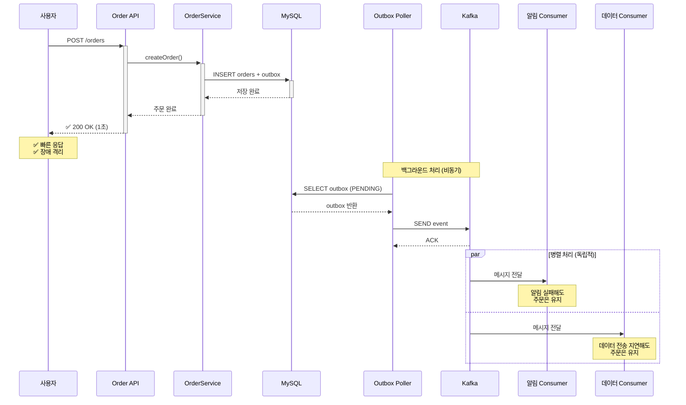