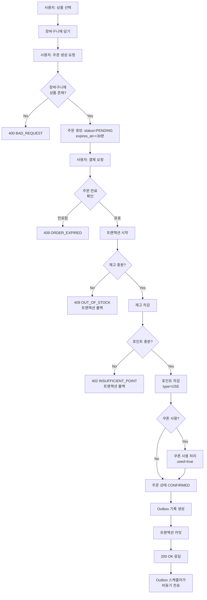
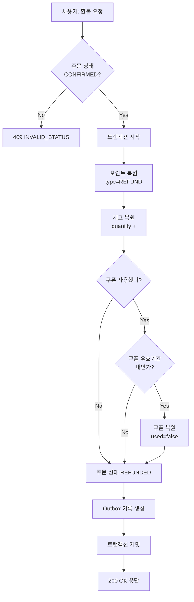
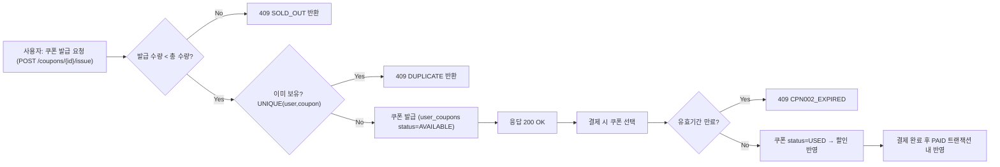

# 요구사항 분석 (이커머스 MVP)

## 0. 범위 / 가정

- **결제는 포인트(잔액) 차감으로 단순화** (실제 PG 미연동)
- **재고는 상품 단위로 관리** (옵션/조합 제외, MVP 범위 축소)
- **외부 데이터 전송은 Outbox 패턴**으로 분리 (전송 실패해도 주문 성공 유지)
- **사용자(고객) 중심 기능만 고려** (관리자 기능 제외)
- **동시성 제어는 간단하게 처리** (분산락은 추후 고려, 낙관적 락 위주)

---

## 1. 스테이크홀더 & 역할/권한

### 1.1 스테이크홀더 (이해관계자)

- **사용자(User/Customer)**: 상품 탐색/주문/결제/쿠폰 사용, 잔액 관리.
- **시스템(System Services)**: 주문/결제 처리, 재고/쿠폰/지갑 정합성 보장, Outbox 송신.
- **외부 데이터 플랫폼(Data Platform)**: 주문 데이터 수신/분석.

### 1.2 역할 & 권한 (최소 권한)

| 역할 | 권한 |
| --- | --- |
| 사용자(User) | 본인 포인트 조회/충전, 상품 조회, 장바구니/주문 생성, 결제 수행, 본인 보유 쿠폰 조회/사용, 선착순 쿠폰 발급 요청, Top5 인기상품 조회 |
| 시스템(System) | 재고 선점/확정/복원, 포인트 차감/환불, 쿠폰 상태 변경, 주문 상태 전이(PENDING→CONFIRMED→REFUNDED), Outbox 기록/전송 재시도 |
| 외부 데이터 플랫폼 | 주문 완료 이벤트 수신 (읽기 전용) |

---

## 2. 기능적 요구사항 (Functional Requirements)

### 포인트 (Point)

- **FR-PNT-01** — 사용자는 본인의 포인트 잔액을 조회할 수 있어야 한다.
- **FR-PNT-02** — 사용자는 포인트를 충전할 수 있어야 한다.
    - *AC*: 충전 시 `POINT` 테이블에 `type=CHARGE` 기록 생성, `balance` 누적.
- **FR-PNT-03** — 사용자는 포인트 사용/충전 내역을 조회할 수 있어야 한다.

### 상품 (Product)

- **FR-PRD-01** — 사용자는 상품 목록을 조회할 수 있어야 한다 (페이징).
- **FR-PRD-02** — 사용자는 개별 상품 상세 정보를 조회할 수 있어야 한다.
- **FR-PRD-03** — 사용자는 최근 3일간 판매량 기준 Top5 인기상품을 조회할 수 있어야 한다.
    - *AC*: `GET /products/top?period=3d&limit=5`
    - *AC*: `ORDER_ITEM` 테이블에서 `created_at >= NOW() - 3 days`인 주문 상품 집계.

### 장바구니 (Cart)

- **FR-CART-01** — 사용자는 상품을 장바구니에 담을 수 있어야 한다.
    - *AC*: `CART_ITEM` 테이블에 `user_id, product_id, quantity` 저장.
    - *AC*: 동일 상품 재추가 시 수량 증가.
- **FR-CART-02** — 사용자는 장바구니 목록을 조회할 수 있어야 한다.
    - *AC*: 재고 부족 상품은 "재고 부족" 표시 (소프트 체크).
- **FR-CART-03** — 사용자는 장바구니 상품을 삭제할 수 있어야 한다.
- **FR-CART-04** — 사용자는 장바구니 상품 수량을 변경할 수 있어야 한다.

### 주문 (Order)

- **FR-ORD-01** — 사용자는 여러 상품을 주문할 수 있어야 한다.
    - *AC*: 주문 생성 시 `status=PENDING` 상태로 생성.
    - *AC*: 주문 생성 시 `ORDER_ITEM` 테이블에 상품 정보 스냅샷 저장 (가격, 수량).
- **FR-ORD-02** — 시스템은 결제 미완료 주문(`PENDING`)을 **자동 만료(CANCELLED)** 처리해야 한다.
    - *AC*: 주문 생성 시 `expires_at = created_at + 30분` 부여.
    - *AC*: 스케줄러가 `expires_at <= now()` AND `status=PENDING` 주문을 `CANCELLED`로 전이.
    - *AC*: 만료 시 재고 복원 (`reserved_quantity` 감소).
- **FR-ORD-03** — 사용자는 본인의 주문 내역을 조회할 수 있어야 한다.

### 결제 (Payment)

> **핵심 플로우 **: 주문 생성 → 재고 선점 → 결제 요청 → 포인트 차감 → 주문 확정(CONFIRMED)

- **FR-PAY-01** — 사용자는 주문을 결제할 수 있어야 한다 (`POST /orders/{id}/payment`).
    - *AC*: 주문 상태가 `PENDING`이고 `now < expires_at`인 경우만 결제 가능.
    - *AC*: 재고 선점 → 포인트 차감 → 주문 상태 `CONFIRMED` 순으로 처리.
    - *AC*: **재고 선점**: `PRODUCT.quantity >= order_quantity` 확인 후 `quantity` 차감.
    - *AC*: **포인트 차감**: `POINT` 테이블에 `type=USE` 기록 추가, `balance` 차감.
    - *AC*: 트랜잭션 내에서 쿠폰 사용(`USER_COUPON.used=true`), Outbox 기록 생성.
- **FR-PAY-02** — 결제 시 쿠폰 할인을 적용할 수 있어야 한다.
    - *AC*: 쿠폰 유효기간 검증 (`use_start_at <= now <= use_end_at`).
    - *AC*: 쿠폰 사용 여부 확인 (`USER_COUPON.used=false`).
- **FR-PAY-03** — 포인트 부족 시 결제가 실패해야 한다.
    - *AC*: 사용자 포인트 잔액 < 최종 결제 금액 → 402 Payment Required 반환.
- **FR-PAY-04** — 사용자는 결제 완료 주문을 환불할 수 있어야 한다.
    - *AC*: `POST /orders/{id}/refund` 호출 시 `status=REFUNDED` 전이.
    - *AC*: 포인트 복원 (`POINT` 테이블에 `type=REFUND` 기록, `balance` 증가).
    - *AC*: 재고 복원 (`PRODUCT.quantity` 증가).
    - *AC*: 쿠폰 복원 (유효기간 내인 경우 `USER_COUPON.used=false`).
    - *AC*: 중복 환불 방지 (Idempotency-Key 검증).

### 쿠폰 (Coupon)

- **FR-CPN-01** — 사용자는 선착순 쿠폰을 발급받을 수 있어야 한다.
    - *AC*: `POST /coupons/{id}/issue` 호출 시 `USER_COUPON` 테이블에 기록 생성.
    - *AC*: `COUPON` 테이블의 `issued_quantity < 최대 발급 수량` 검증 (낙관적 락 사용).
    - *AC*: `(user_id, coupon_id)` UNIQUE 제약으로 중복 발급 방지.
    - *AC*: 발급 기간 검증 (`issue_start_at <= now <= issue_end_at`).
- **FR-CPN-02** — 사용자는 본인이 보유한 쿠폰을 조회할 수 있어야 한다.
    - *AC*: 사용 가능한 쿠폰(`used=false` AND `expired_at > now`) 필터링 가능.

### 외부 연동

- **FR-INT-01** — 결제 성공 시 Outbox 생성 → 데이터 플랫폼 전송

---

## 3. 비기능적 요구사항 (Non-Functional Requirements)

### 정합성/동시성

- **NFR-CON-01** — 재고 차감은 조건부 원자 업데이트로 처리 (`stock >= qty`)
- **NFR-CON-02** — 쿠폰 발급 시 `issued_qty < total_qty` 조건 검증 및 UNIQUE 제약
- **NFR-CON-03** — 다중 인스턴스 환경에서도 공유 자원 정합성 유지

### 내결함성/복구

- **NFR-REL-01** — Outbox 재시도 전략
- **NFR-REL-02** — 결제 실패 시 재고/쿠폰/잔액 원복

### 멱등성/인터페이스

- **NFR-API-01** — Idempotency-Key 지원 (중복 요청 시 이전 응답 반환)
- **NFR-API-02** — 표준 에러 코드/메시지 체계

### 관찰성/성능

- **NFR-OBS-01** — traceId 기반 로깅/메트릭 수집 (주문 성공/실패, outbox 전송률 등 )
- **NFR-PERF-01** — 인덱스 설계 (`orders(paid_at)`, `order_items(product_id)`)

---

## 4. 비즈니스 규칙 및 제약 (Rules & Constraints)

- **R-INV-01** — 재고 차감은 결제 트랜잭션 내에서 수행 (재고 선점 → 포인트 차감 → 주문 확정)
- **R-INV-02** — 재고 부족 시 결제 실패 처리 (`PRODUCT.quantity >= order_quantity`)
- **R-CPN-01** — `(user_id, coupon_id)` 유니크 제약 (1인 1매)
- **R-CPN-02** — 쿠폰은 발급 기간/사용 기간 내에서만 발급/사용 가능
- **R-CPN-03** — 주문당 쿠폰 1개만 사용 가능 (MVP 한정)
- **R-PNT-01** — 포인트 부족 시 결제 실패 (402 Payment Required)
- **R-PNT-02** — 1회 충전 최소 1,000원, 최대 1,000,000원
- **R-INT-01** — 주문 `CONFIRMED` 전이와 Outbox 기록은 동일 트랜잭션 내 수행
- **R-ORD-01** — 주문 만료 시간 30분 (주문 생성 후 미결제 시 자동 취소)

---

## 5. 프로세스 플로우

### 5.1 주문/결제 플로우

> **핵심**: 주문 생성(PENDING) → 결제 요청 → 재고 차감 → 포인트 차감 → 주문 확정(CONFIRMED) → Outbox 생성

### 5.2 환불 플로우

> **핵심**: 결제 완료(CONFIRMED) → 환불 요청 → 포인트/재고/쿠폰 복원 → REFUNDED

### 5.3 쿠폰 플로우

> 핵심: 선착순 발급 + 중복/만료 방지 + 결제 시 USED 전이

---

## 6. 데이터 모델 

### 핵심 테이블

1. **USER** - 사용자 정보
2. **PRODUCT** - 상품 정보 (재고 포함, 옵션 제외)
3. **CART_ITEM** - 장바구니 상품 (`user_id` 포함, CART 테이블 제거)
4. **ORDER** - 주문 (PENDING → CONFIRMED → REFUNDED)
5. **ORDER_ITEM** - 주문 상품 (가격/수량 스냅샷)
6. **POINT** - 포인트 히스토리 (충전/사용/환불, Payment 테이블 대체)
7. **COUPON** - 쿠폰 정보
8. **USER_COUPON** - 사용자별 쿠폰 발급 내역
9. **ORDER_DISCOUNT** - 주문 할인 내역 (쿠폰 적용 기록)
10. **OUTBOX** - 외부 연동 이벤트 큐

---

## 7. 상태 모델 (State Transition)

### 주문 (Order) 상태

| 상태 | 설명 | 전이 이벤트 | 다음 상태 | 비고 |
| --- | --- | --- | --- | --- |
| `PENDING` | 결제 대기 | 결제 성공 | `CONFIRMED` | 결제 트랜잭션 내 원자 처리 |
| `PENDING` | 결제 미진행, 만료 | 자동 만료 (30분) | `CANCELLED` | 재고 영향 없음 (결제 전) |
| `CONFIRMED` | 결제 완료 | 환불 요청 | `REFUNDED` | 포인트/재고/쿠폰 복원 |

**불변식**

- 모든 상태 전이는 **단일 트랜잭션** 내에서 수행한다.
- `CONFIRMED` 전이 시: 재고 차감 + 포인트 차감 + 쿠폰 USED + Outbox 생성이 원자적으로 수행된다.
- `REFUNDED` 전이 시: 포인트 복원, 재고 복원, 쿠폰 복원(유효기간 내)이 수행된다.

---

## 8. 재고 정책 (간소화)

- **장바구니/주문 생성 시**: 재고 예약 없음, 소프트 체크만 수행.
- **결제 트랜잭션 내**: 재고 차감 (`PRODUCT.quantity >= order_quantity` 검증 후 차감).
- **재고 부족 시**: 409 OUT_OF_STOCK 반환, 트랜잭션 롤백.

---

## 9. 금액 처리 규칙 (간소화)

- **금액 필드**: BigDecimal 사용, 반올림 ROUND_HALF_UP
- **가격 스냅샷**: 주문 시점의 상품 가격을 `ORDER_ITEM`에 저장
- **쿠폰 할인**: 정액(`FIXED`) 또는 정률(`PERCENT`), 주문 전체 단위 적용 (MVP)

---

## 10. 인기 상품 집계

- **집계 기준**: 최근 3일간 판매수량 (`ORDER_ITEM` 집계)
- **정렬**: 판매수량 DESC
- **조회**: `GET /products/top?period=3d&limit=5`