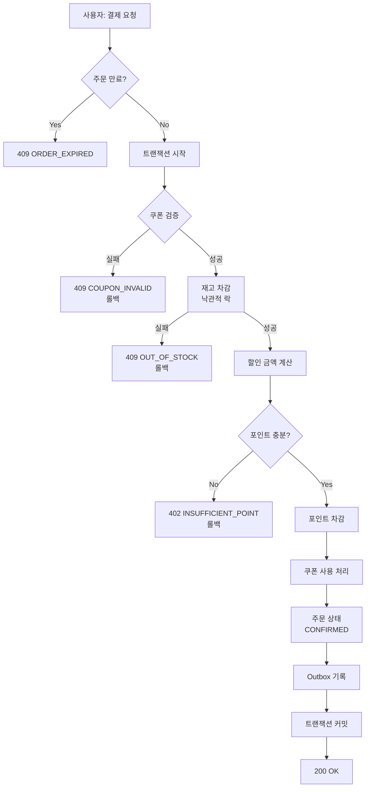

# 요구사항 분석 (이커머스 MVP)

## 0. 범위 / 가정

- **결제는 포인트(잔액) 차감으로 단순화** (실제 PG 미연동)
- **재고는 상품 단위로 관리** (옵션/조합 제외)
- **외부 데이터 전송은 Outbox 테이블 기록만** (전송 로직 제외)
- **사용자(고객) 중심 기능만** (관리자 기능 제외)
- **동시성 제어는 낙관적 락 사용**

---

## 1. 기능적 요구사항

### 포인트
- **FR-PNT-01** — 포인트 잔액 조회
- **FR-PNT-02** — 포인트 충전
- **FR-PNT-03** — 포인트 사용/충전 내역 조회

### 상품
- **FR-PRD-01** — 상품 목록 조회 (페이징)
- **FR-PRD-02** — 상품 상세 조회
- **FR-PRD-03** — 최근 3일간 판매량 Top5 조회

### 장바구니
- **FR-CART-01** — 장바구니 담기
- **FR-CART-02** — 장바구니 조회 (재고 부족 표시)
- **FR-CART-03** — 장바구니 삭제
- **FR-CART-04** — 장바구니 수량 변경

### 주문
- **FR-ORD-01** — 주문 생성 (`status=PENDING`, `expires_at=+30분`)
- **FR-ORD-02** — 주문 자동 만료 (30분 경과 시 `CANCELLED`)
- **FR-ORD-03** — 주문 내역 조회

### 결제

> **핵심 플로우**: 쿠폰 검증 → 재고 차감 → 할인 계산 → 포인트 차감 → 쿠폰 사용 처리 → 주문 확정 → Outbox 기록

- **FR-PAY-01** — 주문 결제 (`POST /orders/{id}/payment`)
    - 쿠폰 검증 → 재고 차감 (낙관적 락) → 할인 계산 → 포인트 차감 → 쿠폰 사용 → 주문 `CONFIRMED` → Outbox 기록
- **FR-PAY-02** — 쿠폰 할인 적용
- **FR-PAY-03** — 포인트 부족 시 결제 실패 (402)
- **FR-PAY-04** — 환불 처리 (`status=REFUNDED`, 포인트/재고/쿠폰 복원)

### 쿠폰
- **FR-CPN-01** — 선착순 쿠폰 발급
    - 발급 수량 증가는 낙관적 락 사용
    - `UNIQUE(user_id, coupon_id)`로 중복 방지
- **FR-CPN-02** — 보유 쿠폰 조회

### 외부 연동
- **FR-INT-01** — 결제 성공 시 Outbox 테이블에 이벤트 기록

---

## 2. 비기능적 요구사항

### 정합성/동시성
- **NFR-CON-01** — 재고 차감은 낙관적 락 사용
- **NFR-CON-02** — 쿠폰 발급은 낙관적 락 + UNIQUE 제약
- **NFR-CON-03** — 다중 인스턴스 환경 정합성 유지

### 내결함성
- **NFR-REL-01** — 결제 실패 시 자동 롤백 (트랜잭션)
- **NFR-API-01** — Idempotency-Key 지원 (환불 중복 방지)

---

## 3. 비즈니스 규칙

- **R-INV-01** — 재고 차감은 결제 트랜잭션 내에서 낙관적 락으로 수행
- **R-CPN-01** — 쿠폰 발급은 낙관적 락 + UNIQUE 제약
- **R-PNT-01** — 포인트 부족 시 결제 실패 (402)
- **R-INT-01** — 주문 `CONFIRMED` 전이와 Outbox 기록은 동일 트랜잭션
- **R-ORD-01** — 주문 만료 시간 30분

---

## 4. 결제 플로우

---

## 5. 데이터 모델

1. **USER** - 사용자
2. **PRODUCT** - 상품 (재고 포함)
3. **CART_ITEM** - 장바구니
4. **ORDER** - 주문 (PENDING → CONFIRMED → REFUNDED)
5. **ORDER_ITEM** - 주문 상품 스냅샷
6. **POINT** - 포인트 히스토리
7. **COUPON** - 쿠폰
8. **USER_COUPON** - 사용자 쿠폰
9. **ORDER_DISCOUNT** - 주문 할인
10. **OUTBOX** - 이벤트 큐

---

## 6. 상태 모델

| 상태 | 전이 이벤트 | 다음 상태 |
| --- | --- | --- |
| `PENDING` | 결제 성공 | `CONFIRMED` |
| `PENDING` | 30분 경과 | `CANCELLED` |
| `CONFIRMED` | 환불 요청 | `REFUNDED` |
