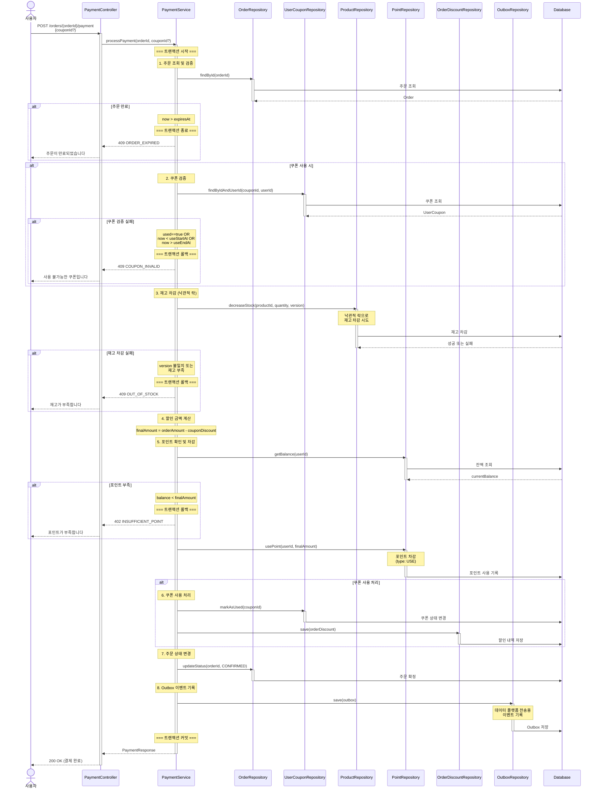
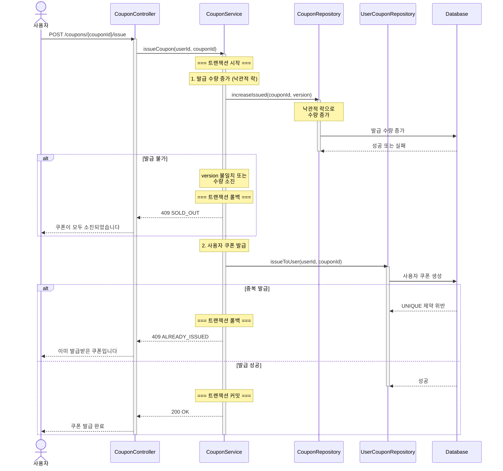
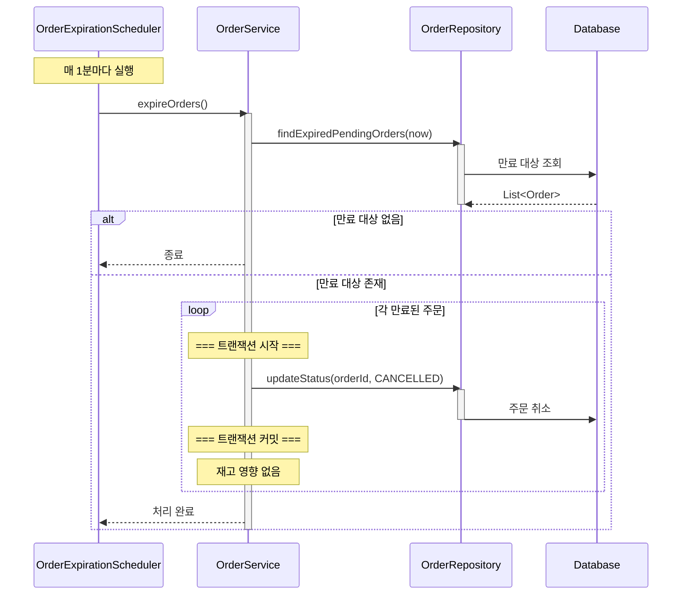

# 시퀀스 다이어그램 (주요 로직)

## FR-PAY-01. 결제 처리

```mermaid
sequenceDiagram
    actor User as 사용자
    participant PC as PaymentController
    participant PS as PaymentService
    participant OR as OrderRepository
    participant UCR as UserCouponRepository
    participant PR as ProductRepository
    participant PTR as PointRepository
    participant ODR as OrderDiscountRepository
    participant OB as OutboxRepository
    participant DB as Database

    User->>PC: POST /orders/{orderId}/payment<br/>{couponId?}
    activate PC

    PC->>PS: processPayment(orderId, couponId?)
    activate PS
    Note over PS: === 트랜잭션 시작 ===

    Note over PS: 1. 주문 조회 및 검증
    PS->>OR: findById(orderId)
    activate OR
    OR->>DB: 주문 조회
    DB-->>OR: Order
    deactivate OR

    alt 주문 만료
        Note over PS: now > expiresAt
        Note over PS: === 트랜잭션 종료 ===
        PS-->>PC: 409 ORDER_EXPIRED
        PC-->>User: 주문이 만료되었습니다
    end

    alt 쿠폰 사용 시
        Note over PS: 2. 쿠폰 검증
        PS->>UCR: findByIdAndUserId(couponId, userId)
        activate UCR
        UCR->>DB: 쿠폰 조회
        DB-->>UCR: UserCoupon
        deactivate UCR

        alt 쿠폰 검증 실패
            Note over PS: used==true OR<br/>now < useStartAt OR<br/>now > useEndAt
            Note over PS: === 트랜잭션 롤백 ===
            PS-->>PC: 409 COUPON_INVALID
            PC-->>User: 사용 불가능한 쿠폰입니다
        end
    end

    Note over PS: 3. 재고 차감 (낙관적 락)
    PS->>PR: decreaseStock(productId, quantity, version)
    activate PR
    Note over PR: 낙관적 락으로<br/>재고 차감 시도
    PR->>DB: 재고 차감
    DB-->>PR: 성공 또는 실패
    deactivate PR

    alt 재고 차감 실패
        Note over PS: version 불일치 또는<br/>재고 부족
        Note over PS: === 트랜잭션 롤백 ===
        PS-->>PC: 409 OUT_OF_STOCK
        PC-->>User: 재고가 부족합니다
    end

    Note over PS: 4. 할인 금액 계산
    Note over PS: finalAmount = orderAmount - couponDiscount

    Note over PS: 5. 포인트 확인 및 차감
    PS->>PTR: getBalance(userId)
    activate PTR
    PTR->>DB: 잔액 조회
    DB-->>PTR: currentBalance
    deactivate PTR

    alt 포인트 부족
        Note over PS: balance < finalAmount
        Note over PS: === 트랜잭션 롤백 ===
        PS-->>PC: 402 INSUFFICIENT_POINT
        PC-->>User: 포인트가 부족합니다
    end

    PS->>PTR: usePoint(userId, finalAmount)
    activate PTR
    Note over PTR: 포인트 차감<br/>(type: USE)
    PTR->>DB: 포인트 사용 기록
    deactivate PTR

    alt 쿠폰 사용 처리
        Note over PS: 6. 쿠폰 사용 처리
        PS->>UCR: markAsUsed(couponId)
        activate UCR
        UCR->>DB: 쿠폰 상태 변경
        deactivate UCR

        PS->>ODR: save(orderDiscount)
        activate ODR
        ODR->>DB: 할인 내역 저장
        deactivate ODR
    end

    Note over PS: 7. 주문 상태 변경
    PS->>OR: updateStatus(orderId, CONFIRMED)
    activate OR
    OR->>DB: 주문 확정
    deactivate OR

    Note over PS: 8. Outbox 이벤트 기록
    PS->>OB: save(outbox)
    activate OB
    Note over OB: 데이터 플랫폼 전송용<br/>이벤트 기록
    OB->>DB: Outbox 저장
    deactivate OB

    Note over PS: === 트랜잭션 커밋 ===

    PS-->>PC: PaymentResponse
    deactivate PS
    PC-->>User: 200 OK (결제 완료)
    deactivate PC
```

## FR-CPN-01. 선착순 쿠폰 발급

```mermaid
sequenceDiagram
    actor User as 사용자
    participant CC as CouponController
    participant CS as CouponService
    participant CPR as CouponRepository
    participant UCR as UserCouponRepository
    participant DB as Database

    User->>CC: POST /coupons/{couponId}/issue
    activate CC

    CC->>CS: issueCoupon(userId, couponId)
    activate CS

    Note over CS: === 트랜잭션 시작 ===

    Note over CS: 1. 발급 수량 증가 (낙관적 락)
    CS->>CPR: increaseIssued(couponId, version)
    activate CPR
    Note over CPR: 낙관적 락으로<br/>수량 증가
    CPR->>DB: 발급 수량 증가
    DB-->>CPR: 성공 또는 실패
    deactivate CPR

    alt 발급 불가
        Note over CS: version 불일치 또는<br/>수량 소진
        Note over CS: === 트랜잭션 롤백 ===
        CS-->>CC: 409 SOLD_OUT
        CC-->>User: 쿠폰이 모두 소진되었습니다
    end

    Note over CS: 2. 사용자 쿠폰 발급
    CS->>UCR: issueToUser(userId, couponId)
    activate UCR
    UCR->>DB: 사용자 쿠폰 생성

    alt 중복 발급
        DB-->>UCR: UNIQUE 제약 위반
        Note over CS: === 트랜잭션 롤백 ===
        CS-->>CC: 409 ALREADY_ISSUED
        CC-->>User: 이미 발급받은 쿠폰입니다
    else 발급 성공
        DB-->>UCR: 성공
        deactivate UCR
        Note over CS: === 트랜잭션 커밋 ===
        CS-->>CC: 200 OK
        CC-->>User: 쿠폰 발급 완료
    end

    deactivate CS
    deactivate CC
```

## FR-ORD-02. 주문 만료 처리 (스케줄러)

```mermaid
sequenceDiagram
    participant Scheduler as OrderExpirationScheduler
    participant OS as OrderService
    participant OR as OrderRepository
    participant DB as Database

    Note over Scheduler: 매 1분마다 실행

    Scheduler->>OS: expireOrders()
    activate OS

    OS->>OR: findExpiredPendingOrders(now)
    activate OR
    OR->>DB: 만료 대상 조회
    DB-->>OR: List<Order>
    deactivate OR

    alt 만료 대상 없음
        OS-->>Scheduler: 종료
    else 만료 대상 존재
        loop 각 만료된 주문
            Note over OS: === 트랜잭션 시작 ===

            OS->>OR: updateStatus(orderId, CANCELLED)
            activate OR
            OR->>DB: 주문 취소
            deactivate OR

            Note over OS: === 트랜잭션 커밋 ===
            Note over OS: 재고 영향 없음
        end

        OS-->>Scheduler: 처리 완료
    end
    deactivate OS
```